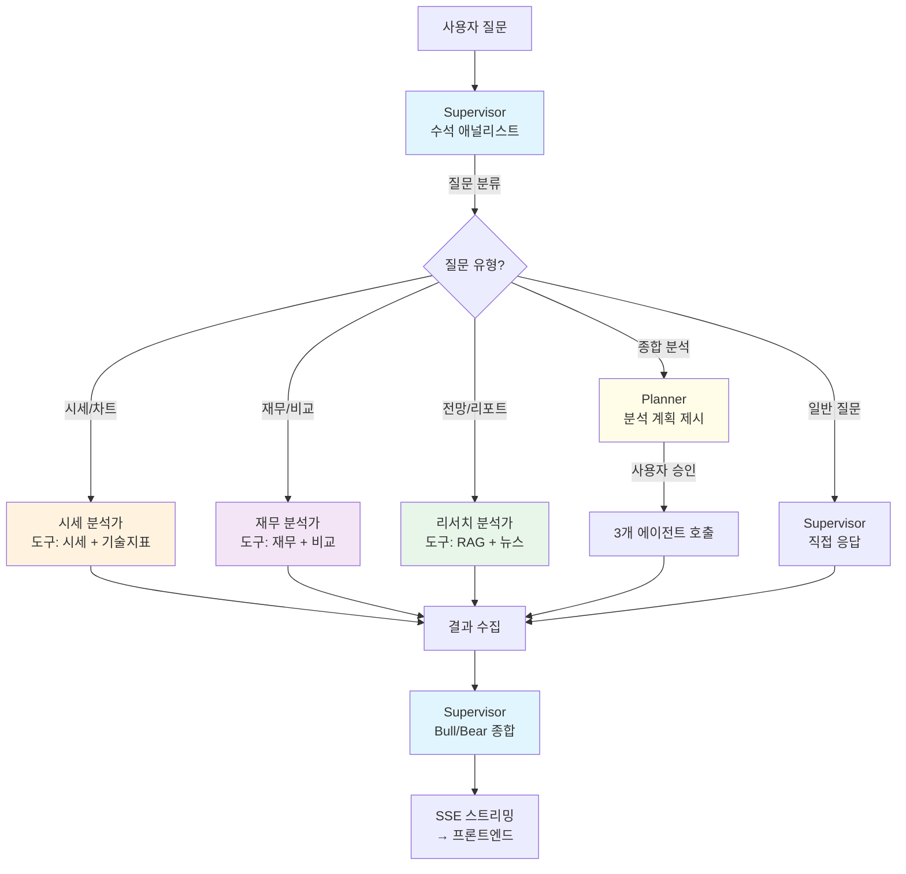
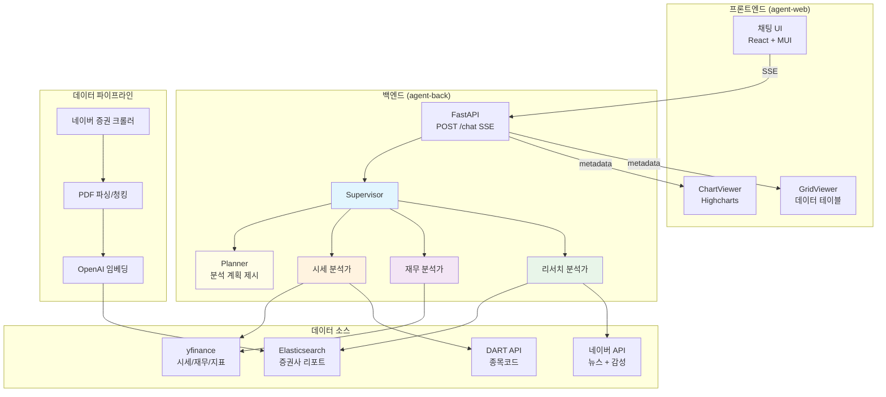

# 주식 전문가 AI 에이전트 — 발표 스토리라인

> 작성일: 2026-04-07 (업데이트)

---

## 발표 주제

1. Agent의 문제범위
2. 동작시연
3. 코드 소개 (페르소나, Tools, SubAgents)
4. 어려웠던 점 및 극복 방법

---

## 1. Agent의 문제범위

### 풀고자 하는 문제

> "개인 투자자가 종합적인 주식 분석을 하려면 증권사 앱, 뉴스 사이트, 재무 데이터 사이트를
> 돌아다니며 정보를 직접 수집하고 조합해야 한다."

### 초기 에이전트의 한계 (Before)

처음 만든 에이전트는 **시세 조회 + 뉴스 링크 나열**만 가능했다. 다음과 같은 문제들이 있었다:

| 문제 | 증상 | 원인 |
|------|------|------|
| 숫자만 나열, 해석 없음 | "PER 15.2, RSI 72" → 이게 높은 건지 낮은 건지 모름 | 기술적 지표/재무 분석 도구 자체가 없음 |
| 뉴스의 좋고 나쁨을 모름 | 뉴스 5개 링크만 나열, 투자에 긍정인지 부정인지 판단 없음 | 감성 분석 없이 단순 검색 결과만 반환 |
| 한쪽 관점만 제시 | "좋습니다" 또는 "나쁩니다" 일방적 의견 | Bull/Bear 양쪽 관점을 제시하는 구조 없음 |
| 종합 분석이 매번 다름 | 같은 질문에 어떤 때는 시세만, 어떤 때는 뉴스만 | 단일 에이전트가 LLM 자율로 도구 선택 (제어 불가) |
| 사용자가 분석 범위 제어 불가 | "종합 분석" 하면 뭘 할지 에이전트가 마음대로 결정 | 분석 계획을 사용자에게 보여주는 단계 없음 |
| 증권사 리포트 활용 불가 | 증권사 목표주가, 투자의견 등 전문 분석 접근 불가 | RAG 시스템 부재 |

### 해결 방식 (After)

| 문제 | 해결 기능 | 구현 방법 |
|------|---------|---------|
| 숫자만 나열 | **기술적 지표 + 재무제표 도구** 추가 | yfinance history()/financials 활용, 추세 해석 포함 |
| 뉴스 감성 모름 | **뉴스 감성 분석** | 리서치 분석가 프롬프트에 긍정/부정/중립 점수 부여 지침 |
| 한쪽 관점만 제시 | **Bull/Bear 토론 구조** | Supervisor가 종합 시 긍정론/부정론 양쪽 제시 후 종합 |
| 종합 분석 불일관 | **멀티에이전트 + StateGraph** | Supervisor가 질문 분류 → 적절한 서브에이전트에 위임 |
| 분석 범위 제어 불가 | **Planner 단계** (Human-in-the-loop) | 분석 계획을 먼저 제시 → 사용자 승인 후 실행 |
| 증권사 리포트 없음 | **RAG (Elasticsearch)** | 증권사 리포트 PDF → 청킹 → 임베딩 → ES 하이브리드 검색 |

---

## 2. 동작시연

### Before/After 비교 시연

#### 시연 1: 뉴스 검색 — 감성 분석 추가

**Before** (문제: 뉴스 링크만 나열, 좋은 뉴스인지 나쁜 뉴스인지 모름)
```
사용자: "삼성전자 최신 뉴스"
에이전트:
  - [삼성전자 HBM3E 양산 본격화](링크)
  - [중국 반도체 경쟁 심화 우려](링크)
  - [삼성전자 2분기 실적 전망](링크)
  → 뉴스 3건입니다. (끝)
```

**After** (해결: 뉴스에 감성 점수 부여 + 전체 센티먼트 요약)
```
사용자: "삼성전자 최신 뉴스"
에이전트:
  [리서치 분석가] → naver_search + 감성 분석
  → "삼성전자 HBM3E 양산 본격화" — 긍정 (0.85)
  → "중국 반도체 경쟁 심화 우려" — 부정 (0.72)
  → "삼성전자 2분기 실적 전망 상향" — 긍정 (0.78)
  → 전체 뉴스 센티먼트: 긍정 우세 (평균 0.64)
  → 요약: HBM 수요 증가로 긍정적 보도가 우세하나, 중국 경쟁은 주의 요인
```

#### 시연 2: 종합 분석 — Bull/Bear 토론 + Planner

**Before** (문제: 매번 다른 결과, 일방적 의견)
```
사용자: "삼성전자 종합 분석해줘"
에이전트:
  → get_stock_price만 호출
  → "삼성전자 현재가 57,800원입니다. 좋은 종목입니다." (끝)
```

**After** (해결: Planner → 멀티에이전트 → Bull/Bear 종합)
```
사용자: "삼성전자 종합 분석해줘"

[Supervisor — Planner 단계]
  "다음 분석을 진행합니다:
   1. 현재 시세 및 기술적 지표 분석
   2. 최근 재무제표 평가
   3. 증권사 리포트 검색
   4. 최신 뉴스 감성 분석
   진행할까요?"

사용자: "네"

[시세 분석가가 분석 중...]
  → 현재가 57,800원 (+1.2%) [yfinance]
  → RSI 65 (중립~과매수 접근), 20일선 위 → 단기 상승 추세
  → [라인 차트: 주가 + 이동평균선]

[재무 분석가가 분석 중...]
  → 매출 301조, 영업이익 45조 (전년대비 +23%), ROE 12.5% [yfinance]
  → [막대 차트: 연간 재무 추이]

[리서치 분석가가 분석 중...]
  → 증권사 컨센서스 목표주가 65,000원 (현재가 대비 +12.5%) [증권리포트]
  → 뉴스 센티먼트: 긍정 우세 (0.64) [네이버뉴스]

[Supervisor — Bull/Bear 종합]
  Bull 관점: HBM3E 양산 본격화 + 반도체 업황 회복 → 목표 70,000원
  Bear 관점: 중국 경쟁 심화 + RSI 과매수 접근 → 단기 조정 가능
  종합 의견: 중장기 긍정적이나 단기 과매수 구간 주의
  ※ 투자 판단은 본인 책임
```

#### 시연 3: 종목 비교 — 정량 비교 테이블

**Before** (문제: 비교 기능 자체가 없음)
```
사용자: "삼성전자 vs SK하이닉스"
에이전트:
  → 삼성전자 주가 조회... SK하이닉스 주가 조회...
  → 두 종목의 시세를 따로 나열 (비교 아님)
```

**After** (해결: 비교 도구 + 테이블 시각화)
```
사용자: "삼성전자 vs SK하이닉스 비교해줘"
에이전트:
  [재무 분석가] → compare_stocks("삼성전자, SK하이닉스")
  → [비교 테이블]
  | 항목 | 삼성전자 | SK하이닉스 |
  |------|---------|-----------|
  | 현재가 | 57,800원 | 182,500원 |
  | PER | 15.2 | 8.7 |
  | 시가총액 | 345조 | 132조 |
  | 52주 수익률 | +18% | +45% |
  
  → SK하이닉스가 PER 기준 저평가, 수익률도 우세
```

#### 시연 4: 증권사 리포트 RAG 검색

**Before** (문제: 증권사 분석 데이터 접근 불가)
```
사용자: "삼성전자 목표주가가 얼마야?"
에이전트:
  → "죄송합니다, 증권사 목표주가 정보를 조회할 수 없습니다."
```

**After** (해결: ES에 적재된 증권사 리포트 RAG 검색)
```
사용자: "삼성전자 목표주가가 얼마야?"
에이전트:
  [리서치 분석가] → search_research_reports("삼성전자 목표주가")
  → 미래에셋: 65,000원 (매수) — "HBM 수요 증가 반영" [증권리포트]
  → 한국투자: 70,000원 (매수) — "반도체 슈퍼사이클 진입" [증권리포트]
  → 컨센서스 평균: 67,500원 (현재가 대비 +16.8%)
```

### 시연 포인트 요약

| 포인트 | Before 문제 | After 해결 |
|--------|-----------|-----------|
| 뉴스 감성 분석 | 링크만 나열 | 긍정/부정 점수 + 센티먼트 요약 |
| Bull/Bear 토론 | 일방적 의견 | 양쪽 관점 제시 후 균형 잡힌 종합 |
| Planner 단계 | 뭘 분석할지 모름 | 분석 계획 제시 → 사용자 승인 |
| 멀티에이전트 | 매번 다른 결과 | 항상 같은 분석 흐름 보장 |
| 차트/테이블 | 텍스트만 | Highcharts 차트 + 데이터 테이블 |
| RAG 검색 | 증권사 리포트 접근 불가 | ES 하이브리드 검색으로 리포트 활용 |

---

## 3. 코드 소개

### 3-1. 페르소나 (Persona) — "왜 역할을 나눴는가"

**문제**: 단일 에이전트에 모든 역할을 맡기면 분석 품질이 들쑥날쑥

**해결**: 전문 분야별로 페르소나를 분리하여 각자 전문성에 집중

```
app/agents/prompts.py
```

| 페르소나 | 해결하는 문제 | 핵심 지침 |
|---------|-------------|---------|
| **Supervisor** (수석 애널리스트) | 종합 분석 불일관 문제 | 질문 분류, 서브에이전트 조율, Bull/Bear 양쪽 제시 후 종합 |
| **시세 분석가** (Market Analyst) | 숫자만 나열 문제 | RSI/MACD 등 지표를 **해석**까지 제공 ("과매수 구간 진입") |
| **재무 분석가** (Fundamental Analyst) | 재무 데이터 부재 문제 | 재무제표 기반 기업 가치 평가, 종목 간 비교 |
| **리서치 분석가** (Research Analyst) | 뉴스 감성 + 리포트 부재 문제 | 뉴스 감성 분석, 증권사 의견 종합 |

핵심 원칙:
- **Blank > Wrong**: 모르는 데이터는 "확인 불가"로 명시, 절대 추측 금지
- **출처 태그**: 모든 수치에 [yfinance], [증권리포트], [네이버뉴스] 등 출처 표기
- **Bull/Bear 균형**: 종합 분석 시 반드시 긍정/부정 양쪽 관점 제시

### 3-2. Tools (도구) — "왜 6개가 필요한가"

각 도구는 **특정 문제를 해결**하기 위해 추가됐다.

```
app/agents/tools.py
```

| 도구 | 해결하는 문제 | 소속 에이전트 |
|------|-------------|-------------|
| `get_stock_price` | 기본 시세 정보 필요 | 시세 분석가 |
| `get_technical_indicators` | "RSI가 72인데 이게 뭐야?" → **지표 해석** 제공 | 시세 분석가 |
| `get_financial_summary` | 재무 데이터 없이 투자 판단 불가 → **재무 건전성** 제공 | 재무 분석가 |
| `compare_stocks` | 종목 따로 조회하면 비교 어려움 → **나란히 비교** | 재무 분석가 |
| `search_research_reports` | 증권사 전문 분석 접근 불가 → **RAG 검색** | 리서치 분석가 |
| `naver_search` | 최신 뉴스 + 감성 모름 → **뉴스 + 감성 분석** | 리서치 분석가 |

### 3-3. SubAgents (서브에이전트) — "왜 나눴는가"

**문제**: 단일 에이전트에 6개 도구를 주면 어떤 도구를 언제 쓸지 LLM이 자율 판단 → 불안정

**해결**: 역할별 서브에이전트로 분리 + Supervisor가 조율



### 3-4. 전체 시스템 아키텍처



### 3-5. 참고한 오픈소스 프로젝트

| 프로젝트 | 가져온 아이디어 |
|---------|--------------|
| [TradingAgents](https://github.com/TauricResearch/TradingAgents) | Bull/Bear 토론 구조, 리스크 관리 관점 |
| [LangAlpha](https://github.com/Chen-zexi/LangAlpha) | Planner 에이전트 (분석 계획 수립 후 실행) |
| [PrimoAgent](https://github.com/ivebotunac/PrimoAgent) | 뉴스 감성 분석, 전문 에이전트 역할 분리 |

---

## 4. 어려웠던 점 및 극복 방법

### [문제 1] 종합 분석 응답 시간 62초 — 서브에이전트 순차 호출 병목

- **증상**: "삼성전자 종합 분석해줘" 요청 시 응답까지 62초 소요. 단순 시세 질문도 20초 이상
- **원인**: 3개 서브에이전트(시세/재무/리서치)를 **순차(for 루프)**로 호출하고 있었음. 각 서브에이전트가 LLM 호출 2~3회 + 외부 API(yfinance, ES, 네이버) 호출을 하는데, 이를 직렬로 실행하니 시간이 누적됨
  ```
  시세 분석가 (~15초) → 재무 분석가 (~15초) → 리서치 분석가 (~20초) → Supervisor 종합 (~12초) = 62초
  ```
- **시도한 방법**: `asyncio.gather`로 3개 서브에이전트를 **병렬 실행**
- **해결**: `all_analysts_node`에서 순차 for 루프를 `asyncio.gather(*tasks)`로 변경. 3개 서브에이전트가 동시에 실행되어 가장 느린 1개의 시간(~20초)으로 단축
  ```
  시세 분석가 ─┐
  재무 분석가 ─┼─ 병렬 (~20초) → Supervisor 종합 (~12초) = ~32초
  리서치 분석가 ┘
  ```
- **배운 점**: 멀티에이전트에서 서브에이전트 간 의존성이 없으면 반드시 병렬 실행해야 한다. LLM 호출은 I/O 바운드이므로 `asyncio.gather`가 효과적

### [문제 2] create_agent() → StateGraph 전환 시 SSE 스트리밍 깨짐

- **증상**: StateGraph로 전환 후 프론트엔드에 아무 응답도 표시되지 않음
- **원인**: 기존 `create_agent()`는 `astream`에서 `model`/`tools` step으로 chunk를 보냈지만, StateGraph는 노드명(`classify`, `market_analyst`, `synthesize` 등)으로 chunk를 보냄. `agent_service.py`의 파싱 로직이 `model`/`tools`만 처리하고 있었음
- **해결**: `agent_service.py`에서 StateGraph 노드명별 분기 처리 추가. `classify` 스킵, `*_analyst` → 진행 상태 표시, `planner` → 분석 계획 표시, `synthesize` → 최종 응답
- **배운 점**: 에이전트 아키텍처를 바꿀 때 SSE 프로토콜(백엔드→프론트 계약)을 먼저 설계하고, 양쪽을 동시에 수정해야 한다

### [문제 3] AsyncSqliteSaver 초기화 실패 — async context manager

- **증상**: `AsyncSqliteSaver.from_conn_string("data/conversations.db")`를 모듈 레벨에서 호출하면 `TypeError: Invalid checkpointer` 에러
- **원인**: `from_conn_string`은 `_AsyncGeneratorContextManager`를 반환하는 async context manager이므로, 모듈 레벨(동기 컨텍스트)에서 직접 사용 불가
- **시도한 방법**: `aiosqlite.connect()`로 직접 연결 생성 후 `AsyncSqliteSaver(conn)` + `await saver.setup()` 호출
- **해결**: `_get_checkpointer()` async 헬퍼 함수를 만들어 지연 초기화. `create_stock_agent()`도 async로 변경
- **배운 점**: LangGraph의 Saver 클래스마다 초기화 방식이 다르므로, 문서보다 실제 반환 타입을 확인해야 한다

### [문제 4] 프론트엔드 React textarea에 fill이 안 먹힘

- **증상**: cmux 브라우저에서 `fill "textarea"` 명령으로 텍스트를 넣어도 실제 전송 시 빈 메시지(`message=''`)가 전달됨
- **원인**: React의 controlled component는 DOM의 value를 직접 변경해도 React state가 업데이트되지 않음. `fill`은 DOM만 변경하고 React의 `onChange` 이벤트를 트리거하지 않음
- **해결**: `nativeInputValueSetter`로 DOM value를 설정한 후 `dispatchEvent(new Event('input', { bubbles: true }))`로 React에 변경 알림
- **배운 점**: React 앱의 브라우저 자동화 시 단순 DOM 조작이 아닌 React 이벤트 시스템을 통해 값을 설정해야 한다

### [문제 5] 한국 주식 한글명 → 티커 변환 로직 중복

- **증상**: 새 도구(`get_technical_indicators`, `get_financial_summary`)마다 한글명→티커 변환 로직을 복사해야 함
- **원인**: 기존 `get_stock_price`에 변환 로직이 함수 내부에 하드코딩되어 있었음
- **해결**: `_resolve_ticker(query)` 공통 함수로 추출하여 모든 도구에서 재사용. 해외 매핑 딕셔너리와 통화 심볼 매핑도 모듈 상수로 분리
- **배운 점**: 도구가 늘어날수록 공통 로직은 반드시 함수로 분리해야 한다. 처음부터 분리하면 좋지만, 두 번째 사용처가 생길 때 분리해도 늦지 않다
