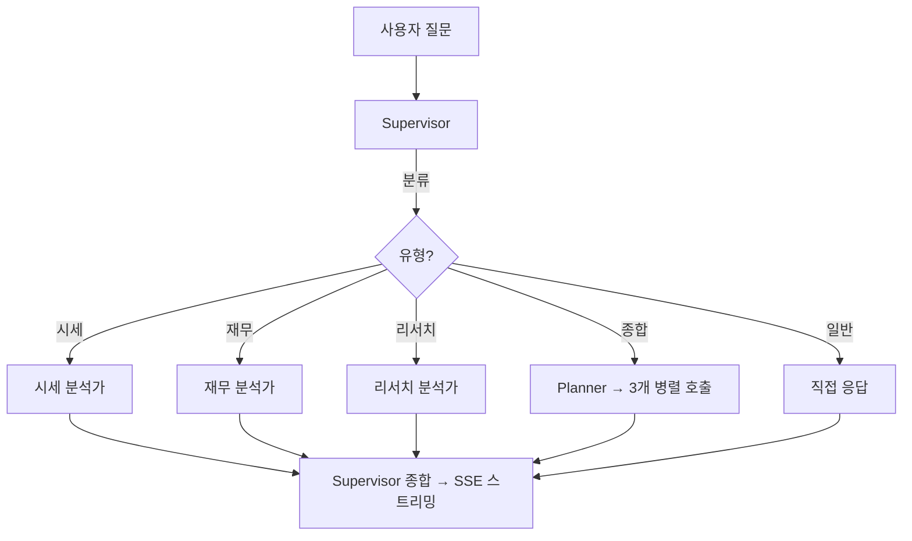

# 주식 전문가 AI 에이전트

> 작성일: 2026-04-07

## 1. Agent의 문제범위

### 풀고자 하는 문제

> "개인 투자자가 종합적인 주식 분석을 하려면 여러 사이트를 돌아다니며 정보를 직접 수집하고 조합해야 한다."

| 분석 영역 | 개인 투자자가 직접 하면 | 에이전트가 자동화 | 데이터 출처 |
|---------|------------------|--------------|-----------|
| 시세 확인 | 증권사 앱/HTS에서 주가·거래량 확인 | `get_stock_price` 한 번으로 조회 | yfinance API |
| 기술적 분석 | 차트 사이트에서 RSI·MACD 직접 해석 | `get_technical_indicators`로 계산+해석 | yfinance 6개월 히스토리 → pandas 계산 |
| 재무 분석 | DART에서 재무제표 다운받아 ROE 등 계산 | `get_financial_summary`로 핵심 지표 요약 | yfinance financials |
| 종목 비교 | 엑셀에 종목별 수치 정리하며 비교 | `compare_stocks`로 비교 테이블 자동 생성 | yfinance (복수 종목 병렬 조회) |
| 뉴스 수집 | 포털에서 검색 후 호재/악재 직접 판단 | `naver_search`로 검색 + LLM 감성 분석 | 네이버 검색 API |
| 증권사 리포트 | 증권사 사이트를 돌아다니며 수집 | `search_research_reports`로 RAG 검색 | Elasticsearch (증권사 리포트 인덱스) |
| 종합 판단 | 위 정보를 모두 조합하여 스스로 판단 | Supervisor가 Bull/Bear 양쪽 관점 종합 | 서브에이전트 결과 종합 (LLM) |

→ 이 전체 과정을 **하나의 질문**으로 자동화하는 것이 에이전트의 목표

### Before → After

| 문제 | Before (단일 에이전트) | After (멀티에이전트) |
|------|---------------------|-------------------|
| 숫자만 나열, 해석 없음 | "PER 15.2" → 높은 건지 낮은 건지 모름 | 기술적 지표 해석 제공 ("RSI 72, 과매수 구간") |
| 뉴스 감성 모름 | 링크 5개 나열 | 감성 점수 + 감성 요약 |
| 일방적 의견 | "좋습니다" 끝 | Bull/Bear 양쪽 관점 제시 |
| 종합 분석 불일관 | 매번 다른 결과 | Supervisor가 질문 분류 → 전문 에이전트 위임 |
| 분석 범위 제어 불가 | 뭘 할지 LLM이 마음대로 | Planner가 분석 계획을 먼저 안내 후 실행 |
| 증권사 리포트 없음 | 접근 불가 | ES 기반 RAG 검색 |

---

## 2. 외부 API 및 데이터 소스

| API / 소스 | 용도 | 사용하는 도구 |
|-----------|------|------------|
| **yfinance** | 실시간 시세, 재무제표, 과거 주가 히스토리 | `get_stock_price`, `get_technical_indicators`, `get_financial_summary`, `compare_stocks` |
| **네이버 검색 API** | 뉴스 검색 (+ LLM 감성 분석) | `naver_search` |
| **Elasticsearch** | 증권사 리서치 리포트 RAG 검색 | `search_research_reports` |
| **DART 기업코드 XML** | 한글 종목명 → 종목코드 변환 (서버 시작 시 캐싱) | 전 도구 공통 (`_resolve_ticker`) |
| **OpenAI API** | LLM 추론 (GPT-4o), 질문 분류, 응답 생성, 임베딩 | 전체 에이전트 |

---

## 3. 코드 소개

### 3-1. 페르소나 (`app/agents/prompts.py`)

| 페르소나 | 역할 | 핵심 지침 |
|---------|------|---------|
| **Supervisor** | 질문 분류 + 결과 종합 | Bull/Bear 양쪽 제시, 출처 태그 |
| **시세 분석가** | 시세 + 기술적 지표 | 지표 **해석** 제공 (숫자 나열 X) |
| **재무 분석가** | 재무제표 + 종목 비교 | 정량 데이터 기반 판단 |
| **리서치 분석가** | 리포트 RAG + 뉴스 | 감성 분석 (0.0~1.0) |

공통 원칙: **Blank > Wrong** (추측 금지) / 출처 태그 필수

### 3-2. Tools (`app/agents/tools.py`)

| 도구 | 역할 | 소속 |
|------|------|------|
| `get_stock_price` | 실시간 시세 | 시세 분석가 |
| `get_technical_indicators` | RSI/MACD/볼린저밴드 | 시세 분석가 |
| `get_financial_summary` | 매출/이익/ROE | 재무 분석가 |
| `compare_stocks` | 종목 비교 테이블 | 재무 분석가 |
| `search_research_reports` | 증권사 리포트 RAG | 리서치 분석가 |
| `naver_search` | 뉴스 + 감성 분석 | 리서치 분석가 |

### 3-3. 멀티에이전트 구조 (`app/agents/stock_agent.py`)



### 3-4. 참고 오픈소스

| 프로젝트 | 가져온 아이디어 |
|---------|--------------|
| [TradingAgents](https://github.com/TauricResearch/TradingAgents) | Bull/Bear 토론 구조 |
| [LangAlpha](https://github.com/Chen-zexi/LangAlpha) | Planner 에이전트 |
| [PrimoAgent](https://github.com/ivebotunac/PrimoAgent) | 뉴스 감성 분석, 역할 분리 |

---

### 4. 카테고리별 문제 → 개선

| 카테고리 | Before 점수 | 발견된 문제 | 개선 조치 |
|---------|:---:|------|---------|
| 주가조회_한국 | 52% | 종목코드 오류 | `_resolve_ticker()` 개선 |
| 뉴스검색 | 72% | 감성 분석 없음 | 리서치 분석가 페르소나 추가 |
| 종합분석 | 90% | 일방적 의견 | Bull/Bear 토론 구조 도입 |

#### 개선 1: `_resolve_ticker()` — 종목코드 매칭 오류 해결

**문제**: "카카오 주가 알려줘" → 카카오(035720)가 아닌 카카오뱅크(323410)를 조회
- 기존에는 각 도구(`get_stock_price`, `get_technical_indicators` 등) 안에 한글→티커 변환 로직이 중복으로 흩어져 있었고, 매칭 로직도 단순 부분 문자열 비교라 오류가 잦았다

**해결**: `_resolve_ticker(query)` 공통 함수로 추출 (`app/agents/tools.py`)
```python
def _resolve_ticker(query: str) -> dict:
    """한글 종목명/영문명/티커 → yfinance 티커로 변환"""
    # 1단계: 해외 주식 매핑 (줄임말 포함)
    #   "테슬라" → TSLA, "엔비디아" → NVDA 등
    # 2단계: DART corpCode.xml에서 정확한 한국 종목코드 조회
    #   "카카오" → 035720.KS (정확 매칭만 허용, Blank > Wrong 원칙)
    # 3단계: 통화 심볼 자동 결정 (₩, $, ¥ 등)
```
- 모든 도구가 이 함수를 공유하므로 매칭 로직 수정 시 한 곳만 고치면 된다
- DART 기업코드 XML을 서버 시작 시 캐싱하여 정확한 매칭 보장

#### 개선 2: 리서치 분석가 페르소나 — 뉴스 감성 분석 추가

**문제**: "삼성전자 뉴스" → 뉴스 링크 5개를 그냥 나열, 투자에 좋은 뉴스인지 나쁜 뉴스인지 판단 없음

**해결**: 리서치 분석가 프롬프트에 감성 분석 지침을 명시 (`app/agents/prompts.py`)
```
# 핵심 지침 — 뉴스 감성 분석:
- 각 뉴스에 감성 점수를 부여합니다:
  - 긍정: 0.5 ~ 1.0
  - 중립: 0.3 ~ 0.5
  - 부정: 0.0 ~ 0.3
- 전체 뉴스의 평균 감성를 계산합니다.
- 투자에 미치는 영향을 한 줄로 요약합니다.
- 예시: "HBM3E 양산 본격화" — 긍정 (0.85)
```
- 별도 감성 분석 모델 없이 **LLM 프롬프트**로 구현 — 도구 추가 없이 페르소나만으로 행동을 변화시킨 사례
- 리서치 분석가는 `naver_search`로 뉴스를 가져온 뒤, 각 뉴스에 점수를 매기고 전체 감성를 요약

#### 개선 3: Bull/Bear 토론 구조 — 일방적 의견 방지

**문제**: "삼성전자 종합 분석" → "좋은 종목입니다" 한마디로 끝. 긍정 편향이 심하고, 리스크 요인을 언급하지 않음

**해결**: Supervisor 프롬프트에 Bull/Bear 토론 구조를 강제 (`app/agents/prompts.py`)
```
# Bull/Bear 토론: 종합 분석 시 반드시 아래 구조를 따릅니다.
  - 긍정론 (Bull Case): 최소 2개 근거
  - 부정론 (Bear Case): 최소 2개 근거
  - 종합 의견: 양쪽을 균형 있게 고려한 결론
```
- Supervisor가 3개 서브에이전트(시세/재무/리서치) 결과를 종합할 때, 긍정/부정 근거를 **각각 최소 2개씩** 제시하도록 강제
- 사용자에게 균형 잡힌 관점 제공 → "좋습니다"로 끝나는 일방적 응답 방지
- 참고: [TradingAgents](https://github.com/TauricResearch/TradingAgents) 프로젝트의 Bull/Bear 토론 패턴에서 착안

### 4-4. 평가 결과 비교 (단일 vs 멀티에이전트)

> 동일 데이터셋(40건) · 동일 도구(6개) · 동일 LLM Judge(GPT-4o-mini)로 공정 비교

| 메트릭 | Before (단일) | After (멀티) | 변화 |
|--------|:---:|:---:|:---:|
| LLM 정확성 | 92.0% | 94.5% | **+2.5%p** |
| LLM 완전성 | 88.5% | 93.0% | **+4.5%p** |
| LLM 유용성 | 89.5% | 93.5% | **+4.0%p** |
| 도구 정확도 | 98.5% | 100.0% | **+1.5%p** |

> - 평가일: 2026-04-07
> - Before: 단일 react agent + 기본 프롬프트 (`doo-single-agent-before`)
> - After: Supervisor + 3개 전문 서브에이전트 (`doo-multi-agent-after`)
> - 특히 **완전성(+4.5%p)**과 **유용성(+4.0%p)** 향상이 뚜렷 — 전문 페르소나 분리와 Bull/Bear 토론 구조의 효과

---

## 5. 발표 시연용 질문 리스트

> 시나리오: "월급 500 모아서 주식 시작하려는 직장인이 에이전트에게 상담하는 상황"

| 순서 | 질문 (대화체) | 시연 포인트 | 에이전트 |
|:---:|------|---------|:------:|
| 1 | 요즘 삼성전자 얼마야? | 기본 시세 조회 — 워밍업 | 시세 |
| 2 | 지금 삼성전자 사도 괜찮은 타이밍이야? | RSI/MACD/볼린저밴드 해석으로 매매 타이밍 판단 | 시세 |
| 3 | 삼성전자 돈은 잘 벌고 있어? | 재무제표 기반 수익성 분석 | 재무 |
| 4 | 삼성전자랑 SK하이닉스 중에 뭐가 더 나아? | 종목 비교 테이블 + 우위 판단 | 재무 |
| 5 | 삼성전자 요즘 무슨 뉴스 나와? | 뉴스 감성 분석 (호재/악재 점수) | 리서치 |
| 6 | 증권사들은 삼성전자 어떻게 봐? | 증권사 리포트 RAG → 목표주가 컨센서스 | 리서치 |
| 7 | 그래서 삼성전자 지금 사도 돼? 종합적으로 알려줘 | Planner → 3개 병렬 → Bull/Bear 종합 (핵심) | 전체 |
| 8 | 아 근데 PER이 뭐야? | 도구 없이 Supervisor가 직접 설명 | 직접 |

### 시연 순서 가이드

- **1~6번**: "하나씩 물어보는 초보 투자자" — 각 서브에이전트가 개별 동작하는 모습
- **7번 (핵심)**: "결국 사야 해 말아야 해?" — 멀티에이전트 전체 흐름 시연 (Planner → 병렬 분석 → Bull/Bear 종합)
- **8번**: "용어를 모르겠어" — 도구 호출 없이 Supervisor가 직접 답변하는 것도 보여줌
