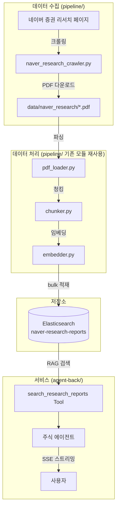
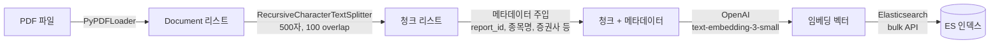
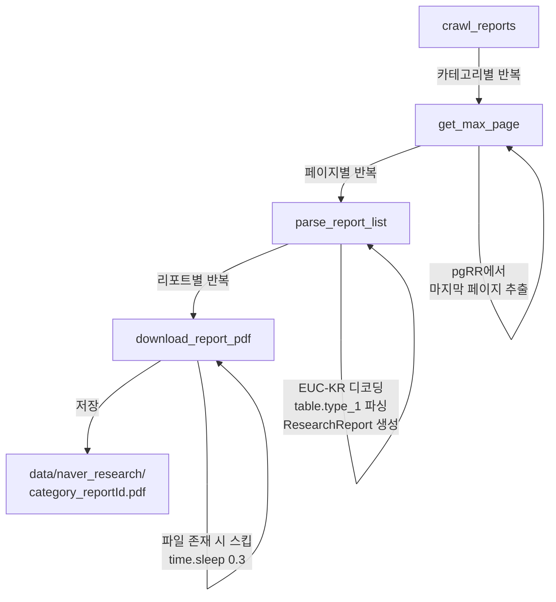
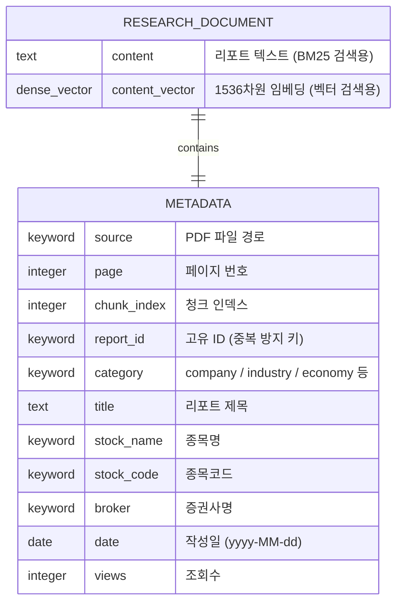
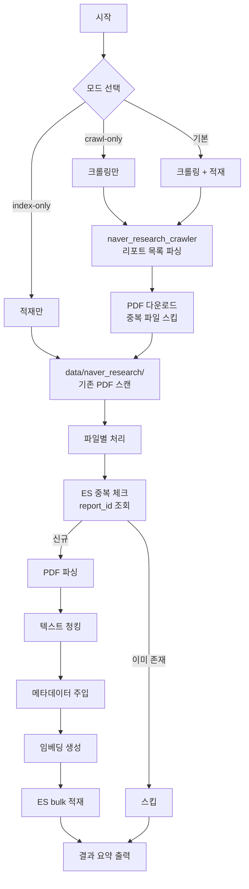
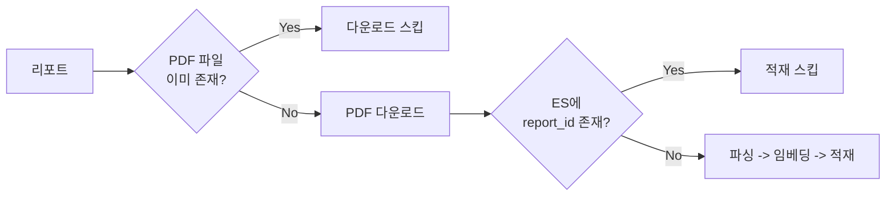
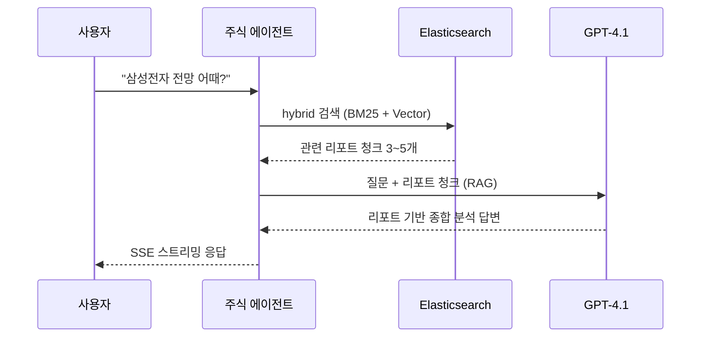

# 네이버 증권 리서치 리포트 크롤러 설계

## 1. 배경 및 목적

### 왜 필요한가?

현재 주식 에이전트는 DART 공시, 네이버 뉴스, yfinance 시세 등 **실시간 API 기반 도구**만 보유하고 있다.
하지만 "삼성전자 전망 어때?", "반도체 산업 분석해줘" 같은 **분석/전망 질문**에는 답할 수 없다.

증권사 애널리스트 리서치 리포트에는 다음이 포함되어 있다:
- 기업 펀더멘털 요약 (매출, 영업이익, 재무제표)
- 목표주가, 투자의견
- 산업 전망, 경쟁사 비교
- 거시경제 영향 분석
- 리스크 요인

이 리포트들을 Elasticsearch에 임베딩하여 **RAG(Retrieval-Augmented Generation)** 기반으로 에이전트에 지식을 부여한다.

### 데이터 소스

**네이버 증권 리서치** (https://finance.naver.com/research/)

| 카테고리 | URL 엔드포인트 | 컬럼 | 일일 업로드 |
|---------|---------------|------|-----------|
| 종목분석 | `company_list.naver` | 종목명, 제목, 증권사, PDF, 작성일, 조회수 | 10~30건 |
| 산업분석 | `industry_list.naver` | 분류, 제목, 증권사, PDF, 작성일, 조회수 | 5~10건 |
| 경제분석 | `economy_list.naver` | 제목, 증권사, PDF, 작성일, 조회수 | 수건 |
| 시황정보 | `market_info_list.naver` | 제목, 증권사, PDF, 작성일, 조회수 | 5~10건 |
| 투자정보 | `invest_list.naver` | 제목, 증권사, PDF, 작성일, 조회수 | 수건 |

- 총 누적 약 27,770개 리포트 (종목분석 기준 2,777페이지)
- 대부분 장 시작 전 오전 7~9시에 업로드
- PDF 형태로 제공

---

## 2. 전체 아키텍처



### 파이프라인 처리 흐름



---

## 3. HTML 구조 분석 (실제 파싱 결과)

### 페이지 URL

```
https://finance.naver.com/research/{category}_list.naver?&page={N}
```
- 인코딩: **EUC-KR**
- 페이지당 10개 리포트

### 테이블 구조

```html
<table class="type_1">
  <tr>
    <td style="padding-left:10">
      <!-- 종목분석: 종목 링크 / 산업분석: 분류명 텍스트 -->
      <a href="/item/main.naver?code=306200" class="stock_item">세아제강</a>
    </td>
    <td>
      <a href="company_read.naver?nid=91273&page=1">반등의 시작</a>
    </td>
    <td>한화투자증권</td>
    <td class="file">
      <a href="https://stock.pstatic.net/stock-research/company/16/20260406_company_52119000.pdf">
        
      </a>
    </td>
    <td class="date">26.04.06</td>
    <td class="date">2068</td>
  </tr>
</table>
```

### PDF URL 패턴

```
https://stock.pstatic.net/stock-research/{category}/{broker_id}/{date}_{category}_{id}.pdf
```

### 페이지네이션

```html
<table class="Nnavi">
  <td class="pgRR">
    <a href="...?&page=2777">맨뒤</a>  <!-- 마지막 페이지 번호 -->
  </td>
</table>
```

---

## 4. 구현 계획

### 위치: `pipeline/` 디렉토리 (기존 파일 수정 없음)

| 파일 | 역할 | 상태 |
|------|------|------|
| `naver_research_crawler.py` | 크롤링 + PDF 다운로드 | 신규 |
| `research_index_mapping.py` | 리서치 전용 ES 인덱스 매핑 | 신규 |
| `research_main.py` | 통합 CLI (크롤링 -> 파싱 -> 청킹 -> 임베딩 -> 적재) | 신규 |
| `pdf_loader.py` | PDF 파싱 | 재사용 |
| `chunker.py` | 텍스트 청킹 | 재사용 |
| `embedder.py` | OpenAI 임베딩 | 재사용 |
| `config.py` | ES/OpenAI 설정 | 재사용 |
| `index_mapping.py` | `get_es_client()` 함수 | 재사용 |

### 4.1 `naver_research_crawler.py`

#### 데이터 모델

```python
@dataclass
class ResearchReport:
    category: str          # "company" | "industry" | "economy" | "market" | "invest"
    title: str             # 리포트 제목
    stock_name: str | None # 종목명 (종목분석만)
    stock_code: str | None # 종목코드 (종목분석만)
    broker: str            # 증권사명
    date: str              # 작성일 (YYYY-MM-DD)
    pdf_url: str           # PDF 다운로드 URL
    report_id: str         # nid (고유 ID)
    views: int             # 조회수
```

#### 카테고리 정의

```python
CATEGORIES = {
    "company":  "https://finance.naver.com/research/company_list.naver",
    "industry": "https://finance.naver.com/research/industry_list.naver",
    "economy":  "https://finance.naver.com/research/economy_list.naver",
    "market":   "https://finance.naver.com/research/market_info_list.naver",
    "invest":   "https://finance.naver.com/research/invest_list.naver",
}
```

#### 핵심 함수



#### 파싱 로직

- `response.encoding = 'euc-kr'` 설정
- `BeautifulSoup(resp.text, 'lxml')`로 파싱
- `<table class="type_1">` 내 `<tr>` 순회
- `len(cols) < 5`인 행 스킵 (구분선)
- 날짜: `"26.04.06"` -> `"2026-04-06"`로 정규화
- rate limit: `time.sleep(0.3)`

#### 저장 구조

```
pipeline/data/naver_research/
  company_91273.pdf
  company_91272.pdf
  industry_44089.pdf
  ...
```

### 4.2 `research_index_mapping.py`

**인덱스명:** `naver-research-reports`



기존 `index_mapping.py`와 비교하여 추가된 메타데이터:
- `report_id` -- 중복 적재 방지 키
- `category` -- 카테고리별 필터링
- `title` -- 리포트 제목 (text + keyword 멀티필드)
- `stock_name` / `stock_code` -- 종목별 필터링
- `broker` -- 증권사별 필터링
- `date` -- 날짜 범위 검색
- `views` -- 인기순 정렬

### 4.3 `research_main.py`

#### 파이프라인 흐름



#### CLI 옵션

| 옵션 | 기본값 | 설명 |
|------|--------|------|
| `--categories` | `company` | 수집 카테고리 (company / industry / economy / market / invest / all) |
| `--max-pages` | `5` | 카테고리당 최대 페이지 수 |
| `--since` | 없음 | 이 날짜 이후 리포트만 (YYYY-MM-DD) |
| `--chunk-size` | `500` | 청크 크기 |
| `--chunk-overlap` | `100` | 청크 오버랩 |
| `--recreate-index` | `false` | 인덱스 삭제 후 재생성 |
| `--crawl-only` | `false` | 크롤링만 수행 |
| `--index-only` | `false` | 이미 다운로드된 PDF만 적재 |
| `--data-dir` | `data/naver_research` | PDF 저장 디렉토리 |

#### 사용 예시

```bash
# 종목분석 최근 5페이지 크롤링 + ES 적재
uv run python research_main.py --categories company --max-pages 5

# 전체 카테고리, 어제 이후만 증분 수집
uv run python research_main.py --categories all --since 2026-04-05

# 크롤링만 (ES 적재 안 함)
uv run python research_main.py --categories industry --max-pages 10 --crawl-only

# 이미 다운로드된 PDF만 ES 적재
uv run python research_main.py --index-only

# 인덱스 재생성 후 적재
uv run python research_main.py --categories company --max-pages 3 --recreate-index
```

---

## 5. 중복 방지



**PDF 다운로드 레벨:** 파일명 `{category}_{report_id}.pdf` 존재 여부 확인

**ES 적재 레벨:** `report_id`로 term 쿼리하여 이미 인덱싱된 문서인지 확인

---

## 6. 스케줄링 (주기적 실행)

리서치 리포트는 매일 업로드되므로 주기적 수집이 필요하다.


### cron 설정

```bash
# 매일 아침 8시, 전날 이후 리포트 전체 카테고리 수집
0 8 * * * cd /path/to/pipeline && uv run python research_main.py --categories all --since $(date -d 'yesterday' +\%Y-\%m-\%d)
```

### agent-back에서 호출하는 쉘 스크립트

```bash
# agent-back/scripts/crawl_research.sh
#!/bin/bash
cd "$(dirname "$0")/../../pipeline"
uv run python research_main.py --categories all --since $(date -d 'yesterday' +%Y-%m-%d)
```

---

## 7. agent-back 연동 (향후)

크롤러로 ES에 데이터가 적재되면, `agent-back`에 ES 검색 Tool을 추가한다.

```python
# app/agents/tools.py에 추가

@tool
def search_research_reports(query: str) -> str:
    """증권사 리서치 리포트에서 종목 분석, 산업 전망 등을 검색합니다."""
    # ES hybrid 검색 (BM25 + Vector)
    # -> 관련 리포트 청크 반환
```

이를 통해 에이전트가 다음과 같은 질문에 답할 수 있게 된다:
- "삼성전자 최근 애널리스트 의견은?"
- "반도체 산업 전망 분석해줘"
- "한화투자증권이 최근 낸 리포트 요약해줘"



---

## 8. 구현 순서

```mermaid
gantt
    title 구현 로드맵
    dateFormat X
    axisFormat %s단계

    section pipeline
    research_index_mapping.py 작성     :1, 2
    naver_research_crawler.py 작성     :2, 4
    research_main.py 작성              :4, 6

    section 테스트
    크롤링 테스트 (--crawl-only)        :6, 7
    전체 파이프라인 테스트               :7, 8

    section agent-back
    ES 검색 Tool 추가 (향후)           :8, 9
```



---

## 9. 비용 및 주의사항

### OpenAI 임베딩 비용

- 모델: `text-embedding-3-small`
- 비용: $0.02 / 1M tokens
- 예상: 리포트 1개 = 5~20 청크 = 2,500~10,000 tokens
- 100개 리포트 = $0.005~0.02 (매우 저렴)

### 크롤링 주의

- `time.sleep(0.3)` 유지 (서버 부하 방지)
- 대량 수집 시 시간: 100페이지 = 약 30초 (크롤링) + PDF 다운로드 시간
- 초기 전체 수집(27,770건)은 시간이 오래 걸리므로 `--max-pages`로 범위 제한 권장
